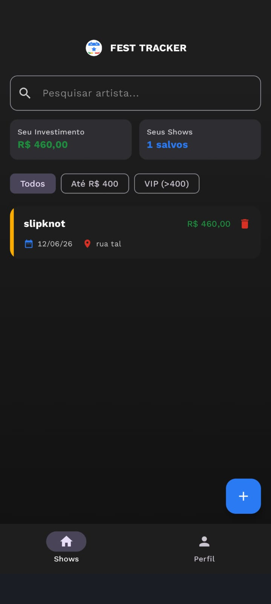

<!DOCTYPE html>
<html lang="pt-BR">

<body>

<h1>⚡ ShowTracker - App Rastreador de Shows</h1>

    

        🎵 [Interface do ShowTracker] 🎸 
        Todos os Shows | Meus Favoritos ❤️
    

    
<em>Mockup da interface e fluxo visual do aplicativo ShowTracker</em>

<h2>📋 Sobre o Projeto</h2>

O <strong>ShowTracker</strong> é um aplicativo Android básico e funcional desenvolvido em Kotlin utilizando o framework moderno <strong>Jetpack Compose</strong>. O projeto serve como um guia prático para desenvolvedores iniciantes, demonstrando como criar uma aplicação interativa que gerencia estados locais de forma eficiente, realiza filtragens complexas e se comunica com o ecossistema Android abrindo navegadores externos, tudo sem a necessidade imediata de dependências complexas de APIs online.

    <strong>🎯 Objetivo Prático:</strong> Ensinar arquitetura em Compose, manipulação de estados mutáveis (State), filtragem dinâmica em tempo real (Search/Chips) e gerenciamento de listas dinâmicas com Lazy layouts.

<h2>🎯 Funcionalidades Implementadas</h2>
<ul class="feature-list">
    <li><strong>Banner de Destaque da Semana:</strong> Um card estilizado no topo com fundo escuro e gradiente destacando o principal evento.</li>
    <li><strong>Barra de Pesquisa Dinâmica:</strong> Filtra a listagem instantaneamente à medida que o usuário digita o nome de um artista ou cidade.</li>
    <li><strong>Filtro Rápido por Cidades (Filter Chips):</strong> Carrossel horizontal com botões clicáveis para filtrar shows por capitais com um único toque.</li>
    <li><strong>Navegação por Abas (TabRow):</strong> Divisão intuitiva entre a lista de "Todos os Shows" e a tela exclusiva de "Meus Favoritos ❤️".</li>
    <li><strong>Lógica de Favoritar (Persistência em Memória):</strong> Botões de coração com animação de mudança de cor que atualizam o estado do item em tempo real.</li>
    <li><strong>Integração com Navegador (Intent de Compra):</strong> Redireciona o usuário para as bilheterias oficiais (Ticketmaster, Eventim, Sympla) de forma transparente.</li>
</ul>

<h2>🎨 Dados Estruturados do App (Mock)</h2>

Como o app funciona offline sem API, os dados foram estruturados de forma fixa para simular um catálogo real de eventos:

<table>
    <thead>
        <tr><th>Artista / Evento</th><th>Cidade</th><th>Localização / Arena</th><th>Data Prevista</th><th>Plataforma de Compra</th></tr>
    </thead>
    <tbody>
        <tr><td><strong>Rock in Rio 2026</strong></td><td>Rio de Janeiro</td><td>Cidade do Rock</td><td>Setembro/2026</td><td>Destaque</td></tr>
        <tr><td><strong>Coldplay</strong></td><td>São Paulo</td><td>Estádio do MorumBIS</td><td>25/10/2026</td><td>Ticketmaster</td></tr>
        <tr><td><strong>Taylor Swift</strong></td><td>Rio de Janeiro</td><td>Estádio Nilton Santos</td><td>12/11/2026</td><td>Eventim</td></tr>
        <tr><td><strong>Vintage Culture</strong></td><td>Belo Horizonte</td><td>Mineirão</td><td>05/12/2026</td><td>Sympla</td></tr>
        <tr><td><strong>Iron Maiden</strong></td><td>São Paulo</td><td>Allianz Parque</td><td>18/12/2026</td><td>Livepass</td></tr>
        <tr><td><strong>Anitta</strong></td><td>Salvador</td><td>Arena Fonte Nova</td><td>20/01/2027</td><td>Ticketmaster</td></tr>
        <tr><td><strong>Alok</strong></td><td>Florianópolis</td><td>P12</td><td>31/12/2026</td><td>Sympla</td></tr>
    </tbody>
</table>

<h2>📝 Como Funciona a Lógica de Estados (Jetpack Compose)</h2>

O aplicativo reage dinamicamente a três estados fundamentais manipulados via <code>remember { mutableStateOf() }</code>:

<h3>Estados Principais Monitorados:</h3>

    <h4>1. Estado de Pesquisa (String)</h4>
    
Captura a string digitada na barra de busca e recalcula a lista visível.

    <code>var pesquisa by remember { mutableStateOf("") }</code>

    <h4>2. Estado da Aba Selecionada (Int)</h4>
    
Controla se o feed renderizará todos os shows ou apenas os favoritados.

    <code>var abaSelecionada by remember { mutableIntStateOf(0) }</code>

    <h4>3. Estado de Filtro de Cidade (String)</h4>
    
Armazena qual Chip de cidade está ativo para a triagem secundária.

    <code>var cidadeSelecionada by remember { mutableStateOf("Todas") }</code>

<h2>🛠️ Tecnologias Utilizadas</h2>

    🎯 Kotlin 1.9+
    ⚡ Jetpack Compose
    🎨 Material Design 3
    📱 Android SDK 21+
    🗺️ Android Intents

<h2>📦 Estrutura de Arquivos Criada</h2>
<pre>
myapplication/
├── src/main/java/com/example/myapplication/
│   ├── MainActivity.kt        # Interface Visual (UI), Abas, Chips e Eventos
│   ├── Show.kt                # Data Class (Modelo de dados do Show)
│   ├── ShowRepository.kt      # Objeto de repositório com os dados simulados (Mock)
│   └── ui/theme/              # Cores, Tipografia e Tema padrão do Material 3
</pre>

<h2>🚀 Como Gerar o APK para o Celular</h2>
<ol>
    <li>No menu superior do Android Studio, clique em <strong>Build</strong>.</li>
    <li>Selecione <strong>Build Bundle(s) / APK(s)</strong> &rarr; <strong>Build APK(s)</strong>.</li>
    <li>Aguarde o Gradle finalizar o processo (acompanhe na barra inferior).</li>
    <li>Quando a notificação aparecer no canto inferior direito, clique em <strong>Locate</strong>.</li>
    <li>Envie o arquivo <code>app-debug.apk</code> para o seu smartphone e instale!</li>
</ol>

    
🎸 Desenvolvido para fins de aprendizado prático em arquitetura e componentização Android Mobile!

    
© 2026 ShowTracker Project - Projetado com Jetpack Compose

</body>
</html>
